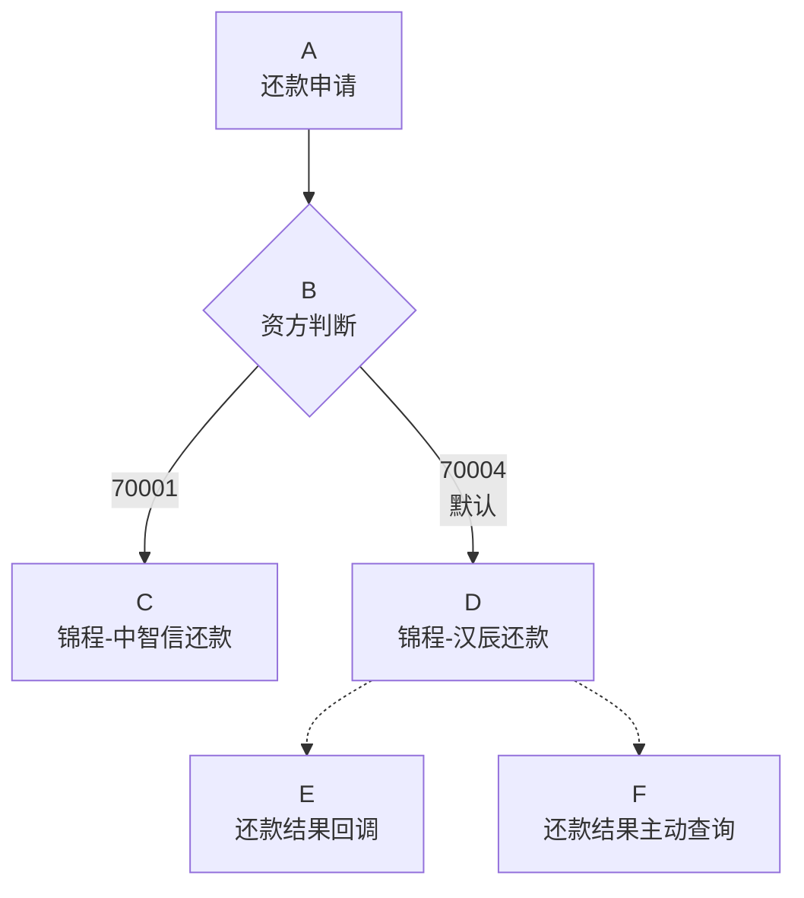

```mermaid
flowchart TD
A[A\n还款申请] -->  B{B\n资方判断}
B{B\n资方判断} -->  |70001| C[C\n锦程-中智信还款]
B{B\n资方判断} -->  |70004\n默认| D[D\n锦程-汉辰还款]
D[D\n锦程-汉辰还款] -.->  E[E\n还款结果回调]
D[D\n锦程-汉辰还款] -.->  F[F\n还款结果主动查询]
```