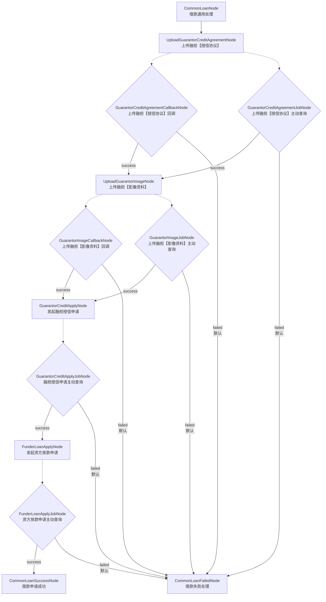

```mermaid
flowchart TD
CommonLoanNode[CommonLoanNode\n借款通用处理] -->  UploadGuarantorCreditAgreementNode[UploadGuarantorCreditAgreementNode\n上传融担【授信协议】]
UploadGuarantorCreditAgreementNode[UploadGuarantorCreditAgreementNode\n上传融担【授信协议】] -.->  GuarantorCreditAgreementCallbackNode{GuarantorCreditAgreementCallbackNode\n上传融担【授信协议】回调}
UploadGuarantorCreditAgreementNode[UploadGuarantorCreditAgreementNode\n上传融担【授信协议】] -.->  GuarantorCreditAgreementJobNode{GuarantorCreditAgreementJobNode\n上传融担【授信协议】主动查询}
GuarantorCreditAgreementCallbackNode{GuarantorCreditAgreementCallbackNode\n上传融担【授信协议】回调} -->  |success| UploadGuarantorImageNode[UploadGuarantorImageNode\n上传融担【影像资料】]
GuarantorCreditAgreementCallbackNode{GuarantorCreditAgreementCallbackNode\n上传融担【授信协议】回调} -->  |failed\n默认| CommonLoanFailedNode[CommonLoanFailedNode\n借款失败处理]
GuarantorCreditAgreementJobNode{GuarantorCreditAgreementJobNode\n上传融担【授信协议】主动查询} -->  |success| UploadGuarantorImageNode[UploadGuarantorImageNode\n上传融担【影像资料】]
GuarantorCreditAgreementJobNode{GuarantorCreditAgreementJobNode\n上传融担【授信协议】主动查询} -->  |failed\n默认| CommonLoanFailedNode[CommonLoanFailedNode\n借款失败处理]
UploadGuarantorImageNode[UploadGuarantorImageNode\n上传融担【影像资料】] -.->  GuarantorImageCallbackNode{GuarantorImageCallbackNode\n上传融担【影像资料】回调}
UploadGuarantorImageNode[UploadGuarantorImageNode\n上传融担【影像资料】] -.->  GuarantorImageJobNode{GuarantorImageJobNode\n上传融担【影像资料】主动查询}
GuarantorImageCallbackNode{GuarantorImageCallbackNode\n上传融担【影像资料】回调} -->  |success| GuarantorCreditApplyNode[GuarantorCreditApplyNode\n发起融担授信申请]
GuarantorImageCallbackNode{GuarantorImageCallbackNode\n上传融担【影像资料】回调} -->  |failed\n默认| CommonLoanFailedNode[CommonLoanFailedNode\n借款失败处理]
GuarantorImageJobNode{GuarantorImageJobNode\n上传融担【影像资料】主动查询} -->  |success| GuarantorCreditApplyNode[GuarantorCreditApplyNode\n发起融担授信申请]
GuarantorImageJobNode{GuarantorImageJobNode\n上传融担【影像资料】主动查询} -->  |failed\n默认| CommonLoanFailedNode[CommonLoanFailedNode\n借款失败处理]
GuarantorCreditApplyNode[GuarantorCreditApplyNode\n发起融担授信申请] -.->  GuarantorCreditApplyJobNode{GuarantorCreditApplyJobNode\n融担授信申请主动查询}
GuarantorCreditApplyJobNode{GuarantorCreditApplyJobNode\n融担授信申请主动查询} -->  |success| FunderLoanApplyNode[FunderLoanApplyNode\n发起资方放款申请]
GuarantorCreditApplyJobNode{GuarantorCreditApplyJobNode\n融担授信申请主动查询} -->  |failed\n默认| CommonLoanFailedNode[CommonLoanFailedNode\n借款失败处理]
FunderLoanApplyNode[FunderLoanApplyNode\n发起资方放款申请] -.->  FunderLoanApplyJobNode{FunderLoanApplyJobNode\n资方放款申请主动查询}
FunderLoanApplyJobNode{FunderLoanApplyJobNode\n资方放款申请主动查询} -->  |success| CommonLoanSuccessNode[CommonLoanSuccessNode\n借款申请成功]
FunderLoanApplyJobNode{FunderLoanApplyJobNode\n资方放款申请主动查询} -->  |failed\n默认| CommonLoanFailedNode[CommonLoanFailedNode\n借款失败处理]
```