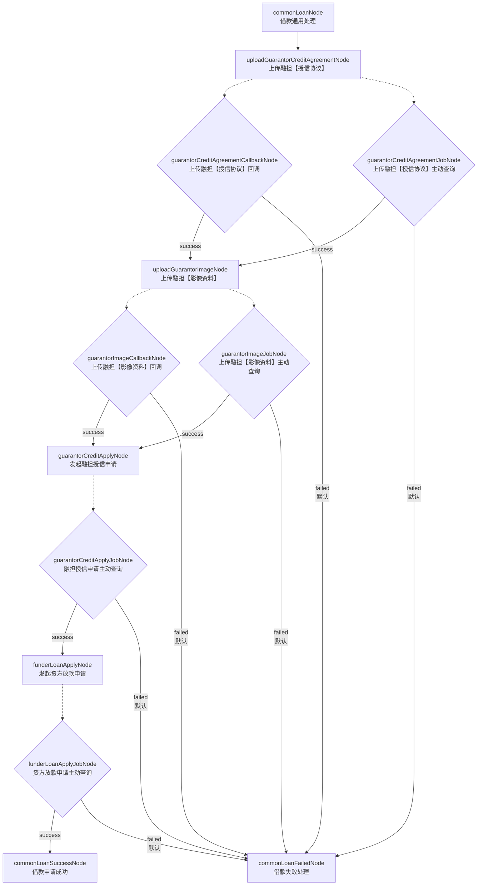

```mermaid
flowchart TD
commonLoanNode[commonLoanNode\n借款通用处理] -->  uploadGuarantorCreditAgreementNode[uploadGuarantorCreditAgreementNode\n上传融担【授信协议】]
uploadGuarantorCreditAgreementNode[uploadGuarantorCreditAgreementNode\n上传融担【授信协议】] -.->  guarantorCreditAgreementCallbackNode{guarantorCreditAgreementCallbackNode\n上传融担【授信协议】回调}
uploadGuarantorCreditAgreementNode[uploadGuarantorCreditAgreementNode\n上传融担【授信协议】] -.->  guarantorCreditAgreementJobNode{guarantorCreditAgreementJobNode\n上传融担【授信协议】主动查询}
guarantorCreditAgreementCallbackNode{guarantorCreditAgreementCallbackNode\n上传融担【授信协议】回调} -->  |success| uploadGuarantorImageNode[uploadGuarantorImageNode\n上传融担【影像资料】]
guarantorCreditAgreementCallbackNode{guarantorCreditAgreementCallbackNode\n上传融担【授信协议】回调} -->  |failed\n默认| commonLoanFailedNode[commonLoanFailedNode\n借款失败处理]
guarantorCreditAgreementJobNode{guarantorCreditAgreementJobNode\n上传融担【授信协议】主动查询} -->  |success| uploadGuarantorImageNode[uploadGuarantorImageNode\n上传融担【影像资料】]
guarantorCreditAgreementJobNode{guarantorCreditAgreementJobNode\n上传融担【授信协议】主动查询} -->  |failed\n默认| commonLoanFailedNode[commonLoanFailedNode\n借款失败处理]
uploadGuarantorImageNode[uploadGuarantorImageNode\n上传融担【影像资料】] -.->  guarantorImageCallbackNode{guarantorImageCallbackNode\n上传融担【影像资料】回调}
uploadGuarantorImageNode[uploadGuarantorImageNode\n上传融担【影像资料】] -.->  guarantorImageJobNode{guarantorImageJobNode\n上传融担【影像资料】主动查询}
guarantorImageCallbackNode{guarantorImageCallbackNode\n上传融担【影像资料】回调} -->  |success| guarantorCreditApplyNode[guarantorCreditApplyNode\n发起融担授信申请]
guarantorImageCallbackNode{guarantorImageCallbackNode\n上传融担【影像资料】回调} -->  |failed\n默认| commonLoanFailedNode[commonLoanFailedNode\n借款失败处理]
guarantorImageJobNode{guarantorImageJobNode\n上传融担【影像资料】主动查询} -->  |success| guarantorCreditApplyNode[guarantorCreditApplyNode\n发起融担授信申请]
guarantorImageJobNode{guarantorImageJobNode\n上传融担【影像资料】主动查询} -->  |failed\n默认| commonLoanFailedNode[commonLoanFailedNode\n借款失败处理]
guarantorCreditApplyNode[guarantorCreditApplyNode\n发起融担授信申请] -.->  guarantorCreditApplyJobNode{guarantorCreditApplyJobNode\n融担授信申请主动查询}
guarantorCreditApplyJobNode{guarantorCreditApplyJobNode\n融担授信申请主动查询} -->  |success| funderLoanApplyNode[funderLoanApplyNode\n发起资方放款申请]
guarantorCreditApplyJobNode{guarantorCreditApplyJobNode\n融担授信申请主动查询} -->  |failed\n默认| commonLoanFailedNode[commonLoanFailedNode\n借款失败处理]
funderLoanApplyNode[funderLoanApplyNode\n发起资方放款申请] -.->  funderLoanApplyJobNode{funderLoanApplyJobNode\n资方放款申请主动查询}
funderLoanApplyJobNode{funderLoanApplyJobNode\n资方放款申请主动查询} -->  |success| commonLoanSuccessNode[commonLoanSuccessNode\n借款申请成功]
funderLoanApplyJobNode{funderLoanApplyJobNode\n资方放款申请主动查询} -->  |failed\n默认| commonLoanFailedNode[commonLoanFailedNode\n借款失败处理]
```